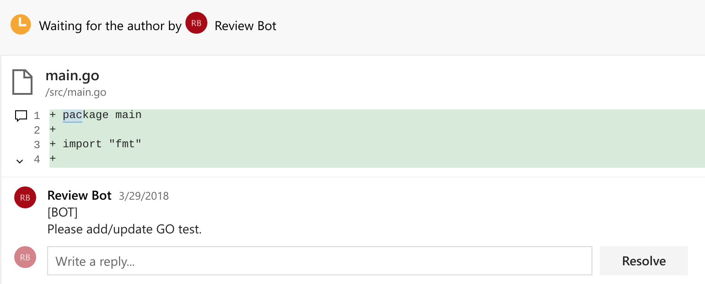
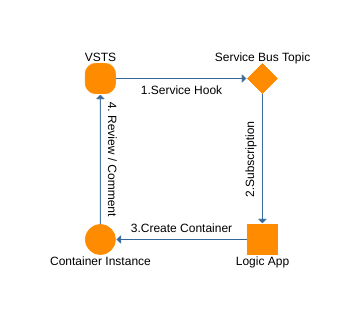
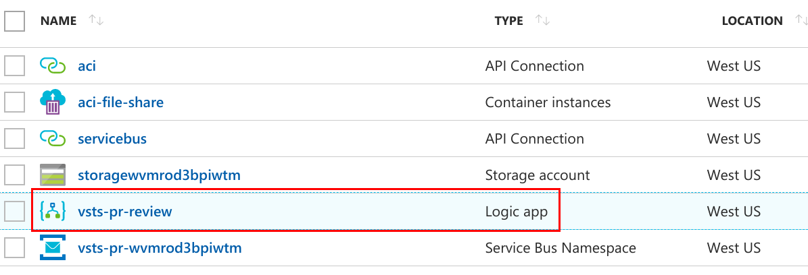
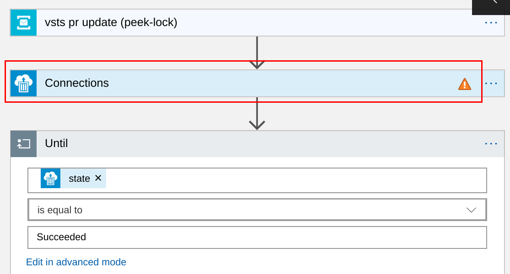
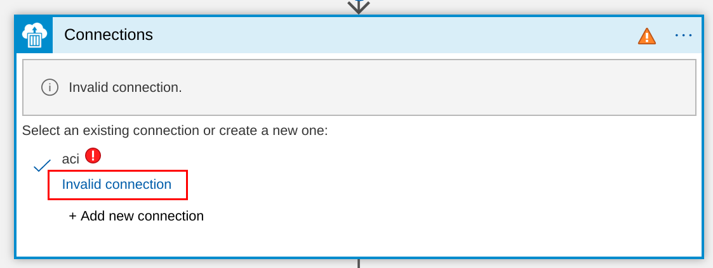
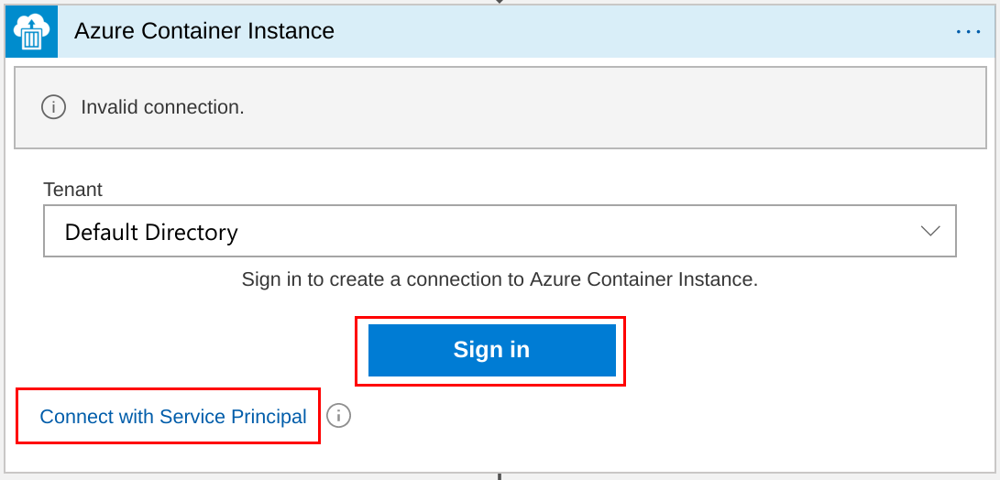

# vsts-pr-reviewer
A VSTS pull request review service, built on Azure Container Instance, Azure Logic App and Azure Service Bus.



# How it works
When a VSTS pull request is created or updated, VSTS sends a notification to an Azure Service Bus topic. As a subscriber of the topic, an Azure Logic App starts an Azure Container Instance upon getting the notification. The container in Azure Container Instance utilizes VSTS REST API to check the changes in the pull request, leave comments and vote approve/wait.



# How to deploy

## Deploy ARM template
<a href="https://portal.azure.com/#create/Microsoft.Template/uri/https%3A%2F%2Fraw.githubusercontent.com%2Fwenwu449%2Fvsts-pr-reviewer%2Fmaster%2Fazuredeploy.json" target="_blank">
    
</a>
<a href="http://armviz.io/#/?load=https%3A%2F%2Fraw.githubusercontent.com%2Fwenwu449%2Fvsts-pr-reviewer%2Fmaster%2Fazuredeploy.json" target="_blank">
    
</a>

## Authorize ACI connection in Logic App
After deployment, navigate to the resource group in Azure portal, open the logic app resource:



Open designer (click "Edit" button), click "Connections" in the flow:



Click "Invalid connection" to configure connection:



Sign in with user account or service pricipal.



Click "Save" button to save the changes.

## Configure VSTS

### Configure Service Hook

Get service bus topic connection string with commands, `<resource-group-name>` is the name of resource group used for ARM template deployment:
```
groupName=<resource-group-name>
nsName=$(az servicebus namespace list -g $groupName | jq -r ".[0].name")
az servicebus topic authorization-rule keys list -g $groupName --namespace-name $nsName --topic-name vsts-pr-update -n vsts-hook | jq -r ".primaryConnectionString" | rev | cut -d ';' -f2- | rev
```
Copy the connection string. You will need to provide this value when creating a Service Hook subscription.

Go to VSTS project to configure service hook.

Click "Create subscription"


### Get VSTS personal access token

## Upload VSTS config

# Try it
